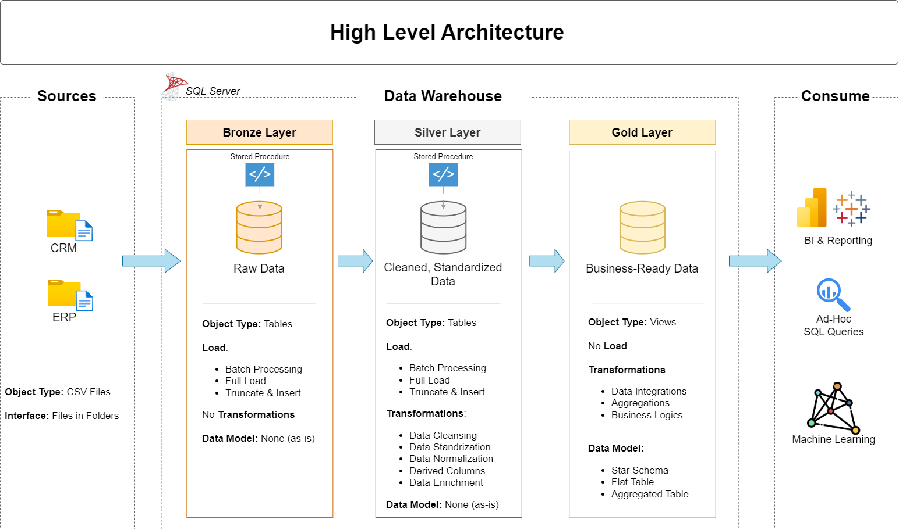

# Data Warehouse & Analytics Project

This repository demonstrates the design and implementation of a modern data warehouse using **Medallion Architecture (Bronze, Silver, Gold)** on **SQL Server**.  
The project focuses on ingesting raw operational data, transforming it through structured layers, and delivering analytics-ready models for reporting and decision-making.

This is a **data engineering–focused portfolio project**, emphasizing data modeling, transformation logic, and warehouse design.

---

## 🏗️ Data Architecture

The warehouse follows the Medallion Architecture pattern:



### Bronze Layer
- Stores raw data exactly as received from source systems
- Source data is ingested from CSV files (ERP and CRM exports)
- No transformations are applied beyond basic loading

### Silver Layer
- Applies data cleansing, standardization, and normalization
- Resolves data quality issues (nulls, duplicates, inconsistent formats)
- Prepares conformed datasets for analytical modeling

### Gold Layer
- Contains business-ready data modeled using a **star schema**
- Includes fact and dimension tables optimized for analytical queries
- Serves as the single source of truth for reporting and insights

---

## 📖 Project Scope & What Was Built

This project covers the **full warehouse build from ingestion to analytics layer**:

- Designed a multi-layer data warehouse architecture (Bronze → Silver → Gold)
- Built ingestion pipelines from CSV files into SQL Server
- Implemented transformation logic to clean and standardize data
- Modeled analytical tables using dimensional modeling principles
- Documented data structures, flows, and naming conventions

---

## ⚙️ Technical Stack

- **Database:** SQL Server  
- **Data Sources:** ERP and CRM CSV extracts  
- **Modeling Approach:** Dimensional modeling (Star Schema)  
- **Architecture Pattern:** Medallion Architecture  

---

## 📂 Repository Structure

```
data-warehouse-project/
│
├── datasets/                           # Raw datasets used for the project (ERP and CRM data)
│
├── docs/                               # Project documentation and architecture details
│   ├── etl.drawio                      # Draw.io file shows all different techniquies and methods of ETL
│   ├── data_architecture.drawio        # Draw.io file shows the project's architecture
│   ├── data_catalog.md                 # Catalog of datasets, including field descriptions and metadata
│   ├── data_flow.drawio                # Draw.io file for the data flow diagram
│   ├── data_models.drawio              # Draw.io file for data models (star schema)
│   ├── naming-conventions.md           # Consistent naming guidelines for tables, columns, and files
│
├── scripts/                            # SQL scripts for ETL and transformations
│   ├── bronze/                         # Scripts for extracting and loading raw data
│   ├── silver/                         # Scripts for cleaning and transforming data
│   ├── gold/                           # Scripts for creating analytical models
│
├── tests/                              # Test scripts and quality files
│
└── README.md                           # Project overview and instructions
```

---

## 📌 Key Takeaways

- Clear separation of raw, refined, and analytics-ready data
- Warehouse design aligned with industry best practices
- SQL-driven transformations and modeling
- Strong emphasis on documentation and maintainability

---

## 🔗 Connect

- **LinkedIn:** https://linkedin.com/in/abdulrahman-aruna-4b564b327  
- **Portfolio:** https://raymanwaytt.github.io/Rayportfolio.github.io/
